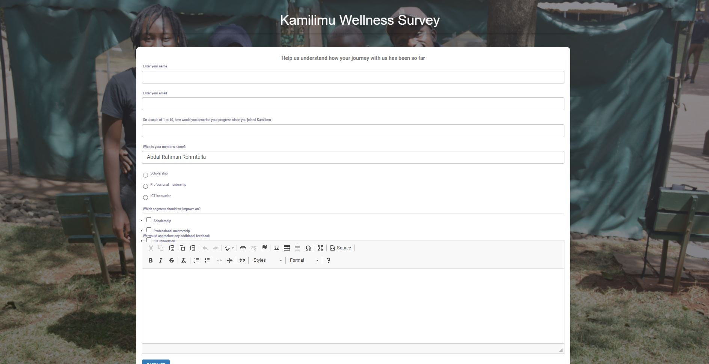

KamiLimu Wellness survey

    Status
     
    
    
     
    
    
    

## Introduction.
This is a survey form that can be customised to collect data from mentees which is then stored on a remote database
#### Screenshot.

> 👾This website is still under construction

> find the deployed site here [https://kamilimu.herokuapp.com/]